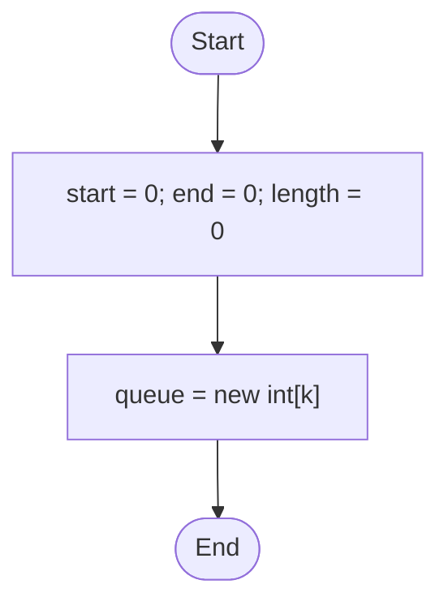
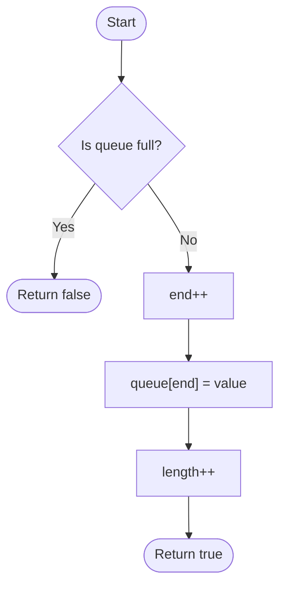
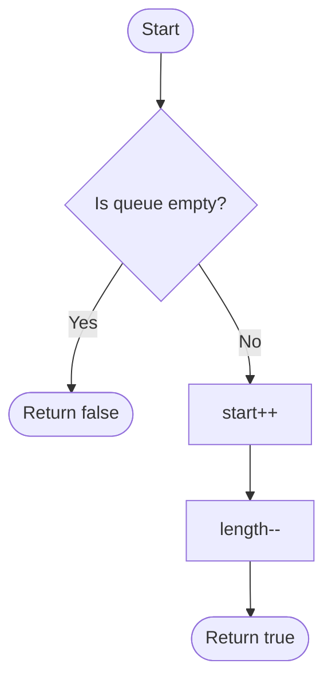
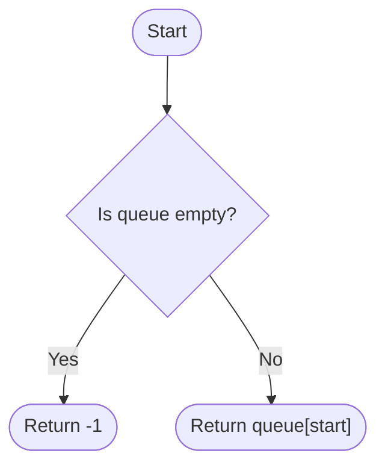
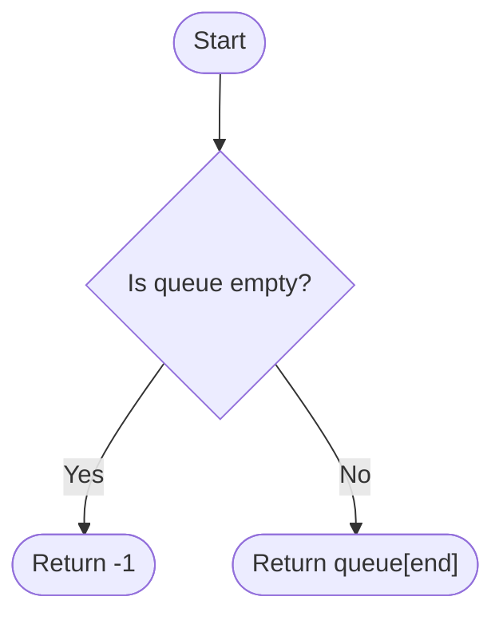

# [Design Circular Queue](https://leetcode.com/explore/learn/card/queue-stack/228/first-in-first-out-data-structure/1337/)

Design your implementation of the circular queue. The circular queue is a linear data structure in which the operations are performed based on FIFO (First In First Out) principle and the last position is connected back to the first position to make a circle. It is also called "Ring Buffer".

One of the benefits of the circular queue is that we can make use of the spaces in front of the queue. In a normal queue, once the queue becomes full, we cannot insert the next element even if there is a space in front of the queue. But using the circular queue, we can use the space to store new values.

Your implementation should support following operations:

- `MyCircularQueue(k)`: Constructor, set the size of the queue to be k.
- `Front`: Get the front item from the queue. If the queue is empty, return -1.
- `Rear`: Get the last item from the queue. If the queue is empty, return -1.
- `enQueue(value)`: Insert an element into the circular queue. Return true if the operation is successful.
- `deQueue()`: Delete an element from the circular queue. Return true if the operation is successful.
- `isEmpty()`: Checks whether the circular queue is empty or not.
- `isFull()`: Checks whether the circular queue is full or not.

**Example:**

```java
MyCircularQueue circularQueue = new MyCircularQueue(3); // set the size to be 3
circularQueue.enQueue(1);  // return true
circularQueue.enQueue(2);  // return true
circularQueue.enQueue(3);  // return true
circularQueue.enQueue(4);  // return false, the queue is full
circularQueue.Rear();  // return 3
circularQueue.isFull();  // return true
circularQueue.deQueue();  // return true
circularQueue.enQueue(4);  // return true
circularQueue.Rear();  // return 4
```

**Note:**

- All values will be in the range of [0, 1000].
- The number of operations will be in the range of [1, 1000].
- Please do not use the built-in Queue library.

## First Solution (Bugs, but idea correct)

So, I went to work on my first solution. I don't know why, but I kept on bumping into bugs. So in the end, I gave up. Here is my strategy for each method:

### Constructor



### Enqueue



### Dequeue



### Front



### Back



And here is my buggy code:

```java
class MyCircularQueue {
    // Store the whole queue
    private int[] queue;
    // Stores the index of the start of the queue
    private int head = 0;
    // Stores the index of the tail of the queue
    private int tail = 0;
    // Stores the length of the queue
    private int length = 0;

    /** Initialize your data structure here. Set the size of the queue to be k. */
    public MyCircularQueue(int k) {
        // Just construct a new array
        queue = new int[k];
    }
    
    /** Insert an element into the circular queue. Return true if the operation is successful. */
    public boolean enQueue(int value) {
        // Check if the queue is full
        if (isFull()) return false;

        // Increment the tail, maintain that it is still
        // in the bounds of the queue
        tail++;
        tail %= queue.length;
        // Add the value
        queue[tail] = value;

        length++;

        return true;
    }
    
    /** Delete an element from the circular queue. Return true if the operation is successful. */
    public boolean deQueue() {
        // Check if the operation is possible
        if (isEmpty()) return false;
        // Increment the head, maintain that it is still
        // in the bounds of the queue
        head++;
        head %= queue.length;
        length--;

        return true;
    }
    
    /** Get the front item from the queue. */
    public int Front() {
        if (isEmpty()) return -1;
        else return queue[head];
    }
    
    /** Get the last item from the queue. */
    public int Rear() {
        if (isEmpty()) return -1;
        else return queue[tail];
    }
    
    /** Checks whether the circular queue is empty or not. */
    public boolean isEmpty() {
        return length == 0;
    }
    
    /** Checks whether the circular queue is full or not. */
    public boolean isFull() {
        return length == queue.length;
    }
}

/**
 * Your MyCircularQueue object will be instantiated and called as such:
 * MyCircularQueue obj = new MyCircularQueue(k);
 * boolean param_1 = obj.enQueue(value);
 * boolean param_2 = obj.deQueue();
 * int param_3 = obj.Front();
 * int param_4 = obj.Rear();
 * boolean param_5 = obj.isEmpty();
 * boolean param_6 = obj.isFull();
 */
```